# NGINX/Ubuntu

- [Creación Carpeta Series](#id1)

- [Creación de la página Web](#id2)

- [Subir fichero con el comando scp por ssh cliente al servidor](#id3)

- [Mover fichero a la ruta /var/www/html/series](#id4)

- [Recargar el servicio de nginx](#id5)

- [Creación de un Virtual Host en el Servidor Ngnix](#id7)

- [Crear carpeta y fichero index.html](#id8)

- [Crear un enlace simbólico en /etc/nginx/sites-enabled](#id9)

- [Esctuctura final de la carpeta series](#id10)

- [Comprobación que la Página Web se pueda visualizar](#id6)

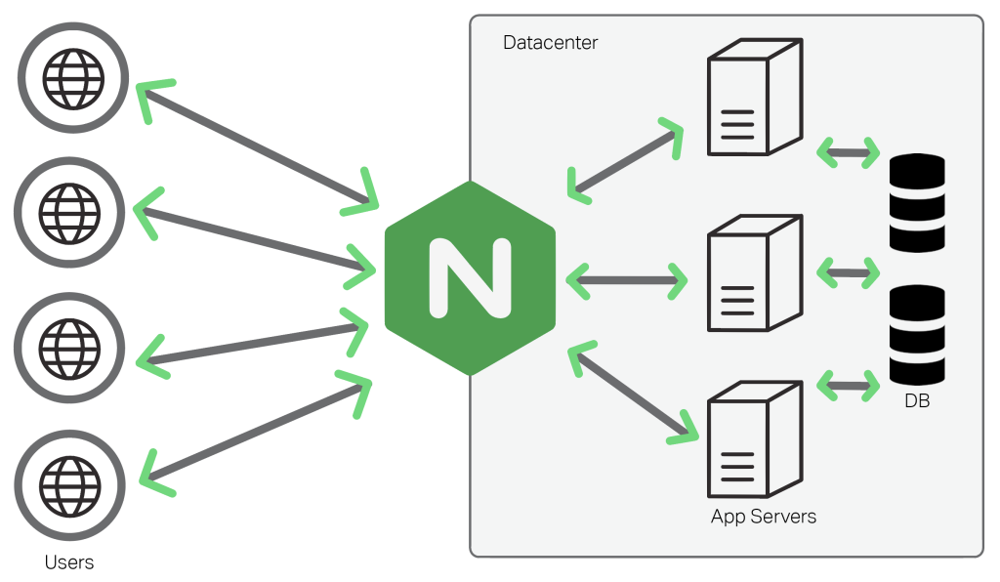

# Creación carpeta de Series 

Lo primero que tenemos que crear, es una carpeta en la siguiente ruta **/var/www/html.**

Como comprobamos la carpeta series no esta creada.

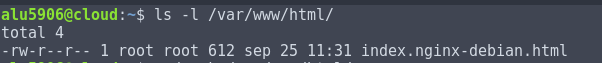

Dentro de la carpeta html creamos la carpeta series.

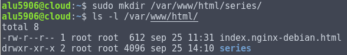

# Creación de la página Web.

En la carpeta de series creamos un fichero llamado index.html.
Abrimos el fichero index.html nano y creamos una página web.

Creo la estructura de las carpetas necesarias.

> series

> > css

> > img

> > index.html

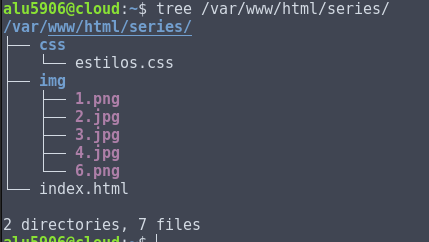

Página Web diseñada con el nano.

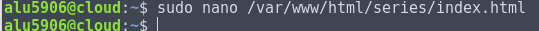

Con el comando cat mostramos el fichero index.html

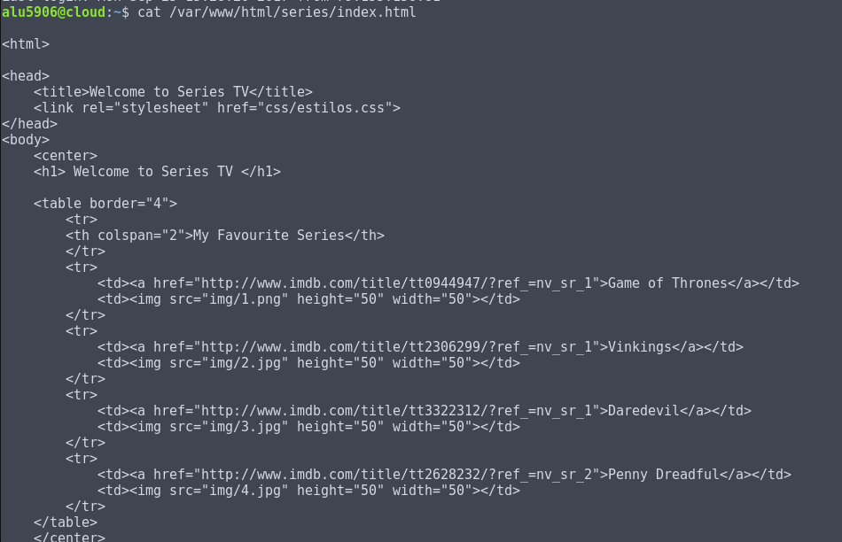

# Subir fichero con el comando scp por ssh cliente al servidor

El comando scp se utiliza para enviar ficheros al servidor o viceversa.

Ejemplo de como enviar un fichero del equipo local al servidor

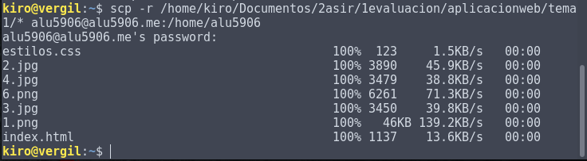

# Mover fichero a la ruta /var/www/html/series

Tenemos que conectarnos al servidor cloud mediante ssh. Ejecutamos un ls -l en el usuario alu5906, encontramos los ficheros css, img, index.html. Con el comando mv movemos los ficheros a la ruta **/var/www/html/series.**

Ver la imagen.

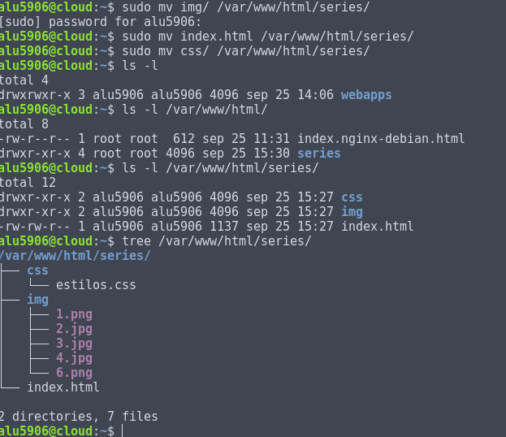

El comando tree es útil para ver la estructura de los ficheros y carpetas.

# Recargar el servicio de nginx
Solo tenemos que escribir el siguiente comando para recargar los cambios.

**sudo systemctl reload nginx.service**

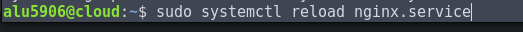

# Creación de un Virtual Host en el Servidor Ngnix 

Tenemos que ir a la siguiente ruta /etc/nginx/sites-available.
Creamos con el nano un fichero nuevo y dentro escribimos lo siguiente.

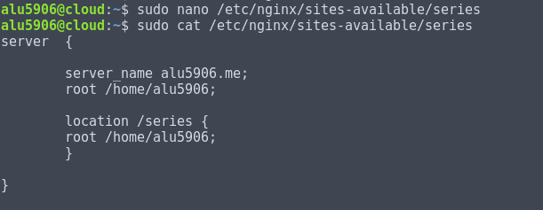

# Crear carpeta y fichero index.html 

En mi caso ya tenia creado toda la escructura de carpeta de series, con css, img y fichero index.html. Solo tengo que moverlo a la siguiente ruta:

#  Crear un enlace simbólico en /etc/nginx/sites-enabled 

Tenemos que crear un enlace simbólico desde /etc/nginx/sites-available/series a la siguiente ruta /etc/nginx/sites-enabled/

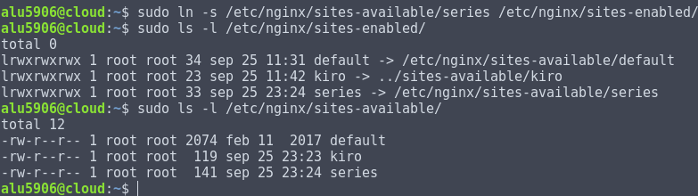

# Estructura final de la carpeta series 

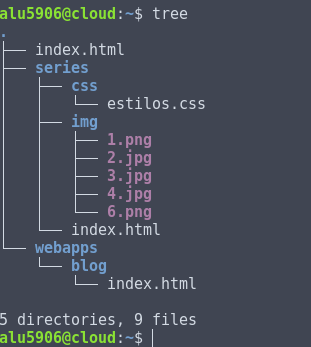

Importante al final siempre recargar el servicio Ngnix

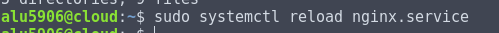

# Comprobación que la Página Web se pueda visualizar.

Solo tenemos que abrir un navegador y escribir la siguiente dirección.

[Página Web de mis series favoritas](http://alu5906.me/series)

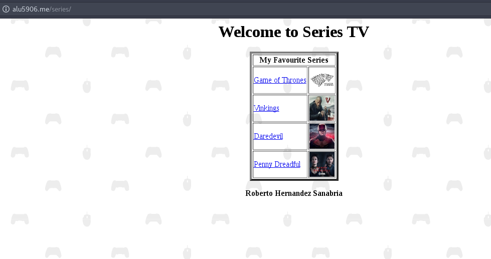
