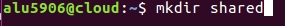
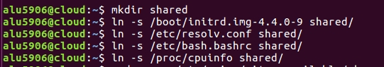
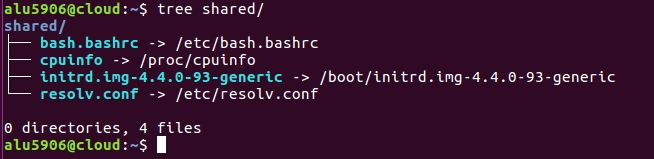
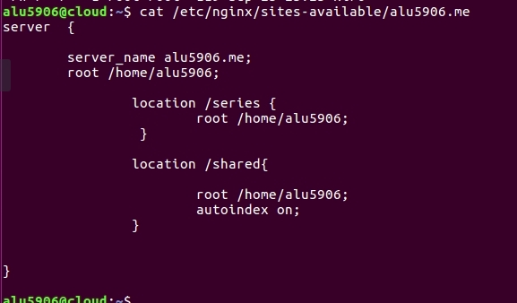
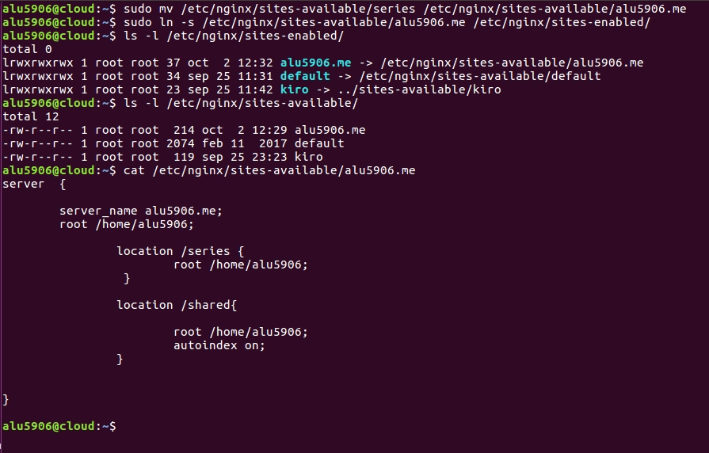
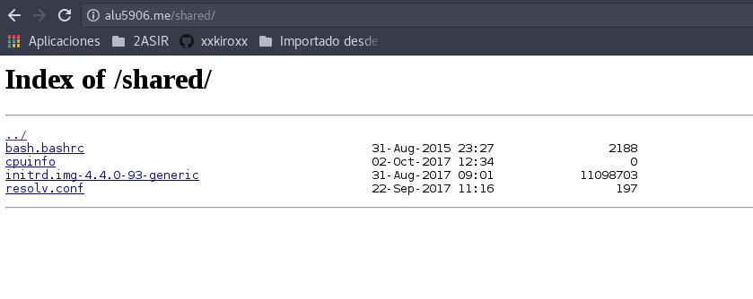

# Listado de Directorios en Ngnix

- [Se crea un listado al entrar en alu5906.me/shared](#id1)

- [Se debe crear un listado de ficheros](#id2)

- [Se crea un fichero de host virtual en la ruta /etc/ngingx/sites-available/alu5906.me](#id3)

- [Creación del enlace simbólico](#id4)

- [Se comprueba que funciona correctamente y se muestra los ficheros en la carpeta shared](#id5)

## Se crea un listado al entrar en [alu5906.me/shared](http://alu5906.me/shared) 

Primero tenemos que crear un directorio en la carpeta de /home/alu5906/shared

## Se debe crear un listado de ficheros 

Accedemos a la ruta de /home/alu5906/shared y dentro creamos enlace simbólico de los siguientes ficheros.

    - /boot/initrd.img-4.4.0-9 (imagen del kernel)
    - /etc/resolv.conf (listado de DNS)
    - /etc/bash.bashrc (configuración global de bash)
    - /proc/cpuinfo (características de la máquina)

Se comprueba que se crearon los enlaces simbólicos.

## Se crea un fichero de host virtual en la ruta /etc/ngingx/sites-available/alu5906.me 

Creamos el fichero y escribimos los siguiente.  Como se muestra en la imagen

## Creación del enlace simbólico

Se crea un enlace simbólico a la ruta /etc/ngingx/sites-available/alu5906.me a la  /etc/nginx/sites-enabled/alu5906.me

Importante recargar el servicio nginx

    * sudo systemctl reload nginx.service

## Se comprueba que funciona correctamente y se muestra los ficheros en la carpeta shared 

