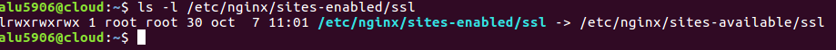
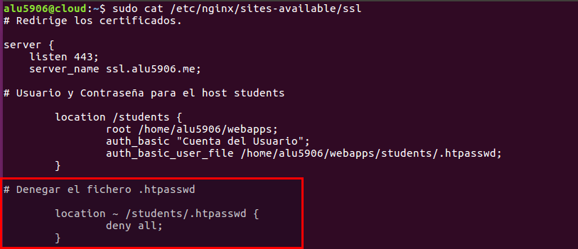
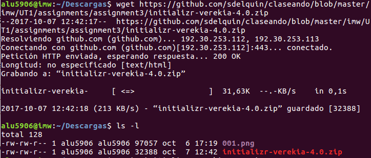
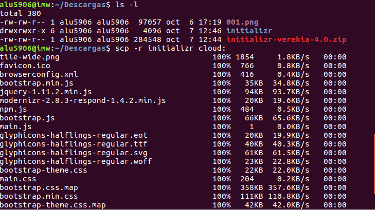
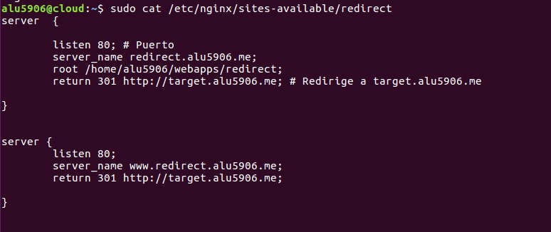
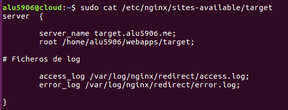

# UT1-A3: Trabajo con Virtual Host

- [Sitio Web 1](#id1)

    - [http://imw.alu5906.me](#id2)

        - [Debe mostrar una página con la imagen de "Diagrama de unidades de trabajo" de IMW (ver moodle de la asignatura)](#id3)

        - [La imagen no debe ser enlazada en remoto, sino se debe descargar al directorio de trabajo en la máquina de producción, y luego usar un tag  apuntando a la ruta local.](#id4)

    - [http://imw.alu5906.me/mec/](#id5)

        - [Debe mostrar una página con un enlace al Real decreto del título de Administración de Sistemas Informáticos en Red - MEC (ver moodle de la asignatura)](#id6)

- [Sitio Web 2](#id7)

    - [http://varlib.alu5906.me:9000](#id8)

    - [Debe mostrar el listado de ficheros y directorios de /var/lib de la máquina de producción.](#id9)

- [Sitio Web 3](#id10)

    - [https://ssl.alu5906.me/students/ (ojo, es https!)](#id11)

    - [Debe pedir usuario/clave. Los datos son:](#id12)

        - [USUARIO: usuario1](#id13)

        - [CLAVE: aula108](#id14)

    - [Debe mostrar una página web con el nombre de todo el alumnado de clase.](#id15)

    - [Se debe prohibir explícitamente el acceso al fichero .htpasswd](#id16)

- [Sitio Web 4](#id17)

    - [http://redirect.alu5906.me](#id18)

        - [Se debe redirigir cualquier petición de este dominio a http://target.alu5906.me](#id19)

        - [Al acceder a http://target.alu5906.me se debe mostrar la página web siguiente initializr-verekia-4.0.zip.](#id23)

            - [Para copiar y descomprimir el fichero initializr.zip se recomienda usar alguna de las siguientes herramientas: curl, wget, scp, unzip.](#id24)

        - [Los logfiles deben ser:](#id25)

            - [/var/log/nginx/redirect/access.log](#id26)

            - [/var/log/nginx/redirect/error.log](#id27)

## Sitio web 1 

### http://imw.alu5906.me 

#### Debe mostrar una página con la imagen de "Diagrama de unidades de trabajo" de IMW (ver moodle de la asignatura).

Primero tenemos que crear una carpeta en la siguiente ruta /home/alu5906/webapps/imw

Copiamos otro fichero index.html para tener toda la estructura y modificamos con los datos que nos indica la práctica.

#### La imagen no debe ser enlazada en remoto, sino se debe descargar al directorio de trabajo en la máquina de producción, y luego usar un tag  apuntando a la ruta local.

El siguiente paso es descargar la imagen de diagrama de unidades de trabajo y subirlo al servidor cloud.

    Utilizamos el comando scp

Solo tenemos que mover la imagen 001.png a la ruta correspondiente. Coma ya muestra en la imagen anterior.

Realizamos un tree para comprobar como está su estructura.

## Crear Fichero Virtual Host

Ya tenemos creado las carpetas, el fichero index.html, solo nos falta crear el virtual host.

Por lo tanto tenemos que ir a la siguiente ruta:

    cd /etc/nginx/sities-available

En esá ruta solo tenemos que crear un fichero llamado imw y escribimos dentro el siguiente contenido.

El siguiente paso es crear un enlace simbólico.

Solo nos falta reiniciar el servicio.

    sudo systemctl reload nginx

### http://imw.alu5906.me/mec/

#### Debe mostrar una página con un enlace al Real decreto del título de Administración de Sistemas Informáticos en Red - MEC (ver moodle de la asignatura).

Lo primero que tenemos que realizar son las carpetas en la siguiente ruta.

    /home/alu5906/webapps/mec

copiamos el index.html de imw y lo metemos en un nuevo index.html y lo modificamos como nos indica la práctica.

Ya tenemos la estructura de la carpeta y el index.html.

El fichero pdf está en el moodle, voy a realizar dos enlaces, uno con la dirección del moodle y la otra descargo el pdf y lo subo en el cloud. Con su enlace local.

Primero tenemos subir el fichero con el comando scp.

y modificamos el html para la ruta del pdf.

## Crear Virtual Host

Tenemos que ir a la ruta siguiente para crear un virtual host.

Solo necesitamos recargar las modificaciones en el servicio.

    sudo systemctl reload nginx

## Sitio web 2

### http://varlib.alu5906.me:9000

Accedemos como varlib.alu5906.me

El resultado correcto especificando el puerto 9000

### Debe mostrar el listado de ficheros y directorios de /var/lib de la máquina de producción.

Tenemos que ir a la ruta de /etc/nginx/sities-available.

Debemos crear un nuevo virtual host llamado varlib.

Abrimos el fichero y escribimos los siguiente.

Com muestra en la imagen anterior, también debemos crear un enlace simbólico de sities-available/varlib a sities-enabled

Solo falta agregar en el fichero que salga por el puerto 9000, debemos abrir el fichero varlib y escribir

    listen 9000;

Por último solo debemos reiniciar el Servicio nginx

    sudo systemctl reload nginx

Tenemos otra opción a la hora de colocar la ruta de /var/lib en el fichero de virtual host.

Primero creamos una carpeta en webapps/varlib.

Luego solo tenemos que crear un enlace simbólico de la ruta /var/lib a la carpeta creada en /home/alu5906/webapps/varlib.

 

Modificamos el fichero de virtual host

 

## Sitio web 3

### https://ssl.alu5906.me/students/ (ojo, es https!)

Se muestra los alumnos

### Debe pedir usuario/clave. Los datos son:

Lo primero que tenemos que crear es la siguiente carpeta.

También debemos crear un index.html

La muestra del html

#### USUARIO: usuario1

Para crear el usuario solo tenemos que crear un fichero llamado .htpasswd y escribimos dentro usuario:"aqui sería la contraseña".

#### CLAVE: aula108

Tenemos que crear con el siguiente comando una contraseña cifrada.

Realizamos un ls -la para ver si se creo correctamente le fichero.

### Modificamos un virtual Host existente.

Solo tenemos que abrir el fichero con un edit y escribimos los siguientes parámetros.

Luego tenemos que crear un enlace simbólico, pero en este caso nosotros ya lo teniamos creado.

Solo debemos ejecutar el comando.

    sudo systemctl reload nginx

### Debe mostrar una página web con el nombre de todo el alumnado de clase.

Abrimos un navegador escribimos la página y debe salir una autenticación para usuarios.

### Se debe prohibir explícitamente el acceso al fichero .htpasswd

Para prohibir el acceso al fichero .htpasswd debemos escribir los siguientes parámetros en el fichero de virtual host llamado ssl

Por lo tanto al acceder desde el navegador.

## Sitio web 4

### http://redirect.alu5906.me

Lo primero que tenemos que crear son las carpetas.

### Se debe redirigir cualquier petición de este dominio a http://target.alu5906.me

 [http://redirect.alu5906.me/test/](http://redirect.alu5906.me/test/) -> [http://target.alu5906.me](http://target.alu5906.me)

 [http://www.redirect.alu5906.me/probando/](http://www.redirect.alu5906.me/probando/) -> [http://target.alu5906.me](http://target.alu5906.me)

 [http://www.redirect.alu5906.me/hola/](http://www.redirect.alu5906.me/hola/) -> [http://target.alu5906.me](http://target.alu5906.me)

### Al acceder a http://target.alu5906.me se debe mostrar la página web siguiente initializr-verekia-4.0.zip.

Copiamos la url del fichero para descargar y escribimos el siguiente comando.

La página debe quedar de la siguiente manera:

#### Para copiar y descomprimir el fichero initializr.zip se recomienda usar alguna de las siguientes herramientas: curl, wget, scp, unzip.

Utilizamos el comando unzip para descomprimir el fichero.

Con el comando scp subimos la carpeta completa al servidor cloud.

Comprobamos que se subio correctamente la carpeta

Ya tenemos las carpetas creada y el fichero subido al servidor. Solo falta crear un virtual host.

En este caso nosotros ya tenemos varios virtual host creado y lo que realizó es copiar un fichero de virtual host con un nombre diferente y lo abro para modificar los nuevos parámetros.

Parámetros que debemos modificar tanto en el redirect.

Parámetros que debemos modificar tanto en el target.

Solo nos falta crear los enlace simbólico de cada uno.

### Los log files deben ser:

#### /var/log/nginx/redirect/access.log

Lo primero tenemos que crear una carpeta.

Luego solo tenemos que crear el fichero.

#### /var/log/nginx/redirect/error.log

Creamos el fichero para el error.log

Por último solo tenemos que modificar el fichero de virtual host, en la siguiente ruta.

    /etc/nginx/sities-available/redirect

Escribimos los siguientes parámetros.

Cambiar permisos de la carpeta y fichero log

Comprobamos que el fichero access.log funciona.

