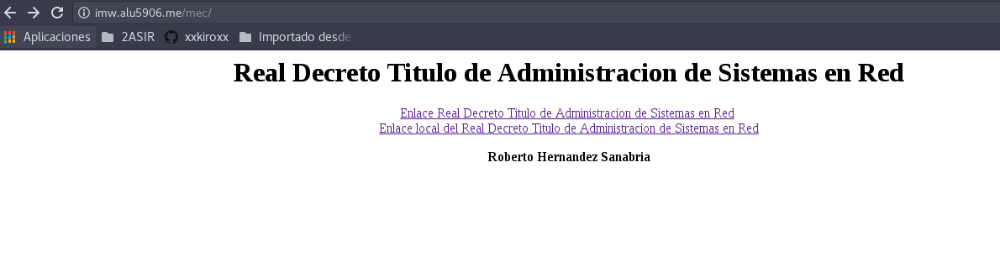
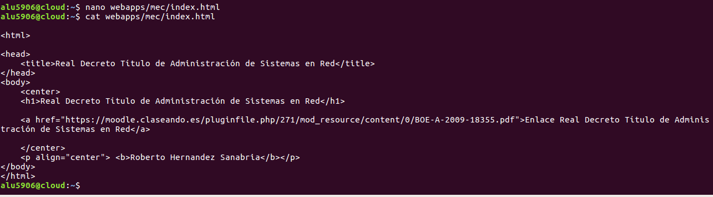

# UT1-A3: Trabajo con Virtual Host

- [Sitio Web 1](#id1)

    - [http://imw.alu5906.me](#id2)

        - [Debe mostrar una página con la imagen de "Diagrama de unidades de trabajo" de IMW (ver moodle de la asignatura)](#id3)

        - [La imagen no debe ser enlazada en remoto, sino se debe descargar al directorio de trabajo en la máquina de producción, y luego usar un tag  apuntando a la ruta local.](#id4)

    - [http://imw.alu5906.me/mec/](#id5)

        - [Debe mostrar una página con un enlace al Real decreto del título de Administración de Sistemas Informáticos en Red - MEC (ver moodle de la asignatura)](#id6)

- [Sitio Web 2](#id7)

    - [http://varlib.alu5906.me:9000](#id8)

    - [Debe mostrar el listado de ficheros y directorios de /var/lib de la máquina de producción.](#id9)

- [Sitio Web 3](#id10)

    - [https://ssl.alu5906.me/students/ (ojo, es https!)](#id11)

    - [Debe pedir usuario/clave. Los datos son:](#id12)

        - [USUARIO: usuario1](#id13)

        - [CLAVE: aula108](#id14)

    - [Debe mostrar una página web con el nombre de todo el alumnado de clase.](#id15)

    - [Se debe prohibir explícitamente el acceso al fichero .htpasswd](#id16)

- [Sitio Web 4](#id17)

    - [http://redirect.alu5906.me](#id1)

        - [Se debe redirigir cualquier petición de este dominio a http://target.alu5906.me](#id19)

            - [http://redirect.alu5906.me/test/ -> http://target.alu5906.me](#id20)

            - [http://www.redirect.alu5906.me/probando/ -> http://target.alu5906.me](#id21)

            - [http://www.redirect.alu5906.me/hola/ -> http://target.alu5906.me](#id22)

        - [Al acceder a http://target.alu5906.me se debe mostrar la página web siguiente initializr-verekia-4.0.zip.](#id23)

            - [Para copiar y descomprimir el fichero initializr.zip se recomienda usar alguna de las siguientes herramientas: curl, wget, scp, unzip.](#id24)

        - [Los logfiles deben ser:](#id25)

            - [/var/log/nginx/redirect/access.log](#id26)

            - [/var/log/nginx/redirect/error.log](#id27)

## Sitio web 1 

### http://imw.alu5906.me 

#### Debe mostrar una página con la imagen de "Diagrama de unidades de trabajo" de IMW (ver moodle de la asignatura).

Primero tenemos que crear una carpeta en la siguiente ruta /home/alu5906/webapps/imw

Copiamos otro fichero index.html para tener toda la estructura y modificamos con los datos que nos indica la práctica.

#### La imagen no debe ser enlazada en remoto, sino se debe descargar al directorio de trabajo en la máquina de producción, y luego usar un tag  apuntando a la ruta local.

El siguiente paso es descargar la imagen de diagrama de unidades de trabajo y subirlo al servidor cloud.

    Utilizamos el comando scp

Solo tenemos que mover la imagen 001.png a la ruta correspondiente. Coma ya muestra en la imagen anterior.

Realizamos un tree para comprobar como está su estructura.

## Crear Fichero Virtual Host

Ya tenemos creado las carpetas, el fichero index.html, solo nos falta crear el virtual host.

Por lo tanto tenemos que ir a la siguiente ruta:

    cd /etc/nginx/sities-available

En esá ruta solo tenemos que crear un fichero llamado imw y escribimos dentro el siguiente contenido.

El siguiente paso es crear un enlace simbólico.

Solo nos falta reiniciar el servicio.

    sudo systemctl reload nginx

### http://imw.alu5906.me/mec/

#### Debe mostrar una página con un enlace al Real decreto del título de Administración de Sistemas Informáticos en Red - MEC (ver moodle de la asignatura).

Lo primero que tenemos que realizar son las carpetas en la siguiente ruta.

    /home/alu5906/webapps/mec

copiamos el index.html de imw y lo metemos en un nuevo index.html y lo modificamos como nos indica la práctica.

Ya tenemos la estructura de la carpeta y el index.html.

## Crear Virtual Host

Tenemos que ir a la ruta siguiente para crear un virtual host.

Solo necesitamos recargar las modificaciones en el servicio.

    sudo systemctl reload nginx

## Sitio web 2

### http://varlib.alu5906.me:9000

Accedemos como varlib.alu5906.me

El resultado correcto especificando el puerto 9000

### Debe mostrar el listado de ficheros y directorios de /var/lib de la máquina de producción.

Tenemos que ir a la ruta de /etc/nginx/sities-available.

Debemos crear un nuevo virtual host llamado varlib.

Abrimos el fichero y escribimos los siguiente.

Com muestra en la imagen anterior, también debemos crear un enlace simbólico de sities-available/varlib a sities-enabled

Solo falta agregar en el fichero que salga por el puerto 9000, debemos abrir el fichero varlib y escribir

    listen 9000;

Por último solo debemos reiniciar el Servicio nginx

    sudo systemctl reload nginx

## Sitio web 3

### https://ssl.alu5906.me/students/ (ojo, es https!)

### Debe pedir usuario/clave. Los datos son:

#### USUARIO: usuario1

#### CLAVE: aula108

### Debe mostrar una página web con el nombre de todo el alumnado de clase.

### Se debe prohibir explícitamente el acceso al fichero .htpasswd

## Sitio web 4

### http://redirect.alu5906.me

### Se debe redirigir cualquier petición de este dominio a http://target.alu5906.me

#### http://redirect.alu5906.me/test/ -> http://target.alu5906.me

#### http://www.redirect.alu5906.me/probando/ -> http://target.alu5906.me

#### http://www.redirect.alu5906.me/hola/ -> http://target.alu5906.me

### Al acceder a http://target.alu5906.me se debe mostrar la página web siguiente initializr-verekia-4.0.zip.

#### Para copiar y descomprimir el fichero initializr.zip se recomienda usar alguna de las siguientes herramientas: curl, wget, scp, unzip.

### Los log files deben ser:

#### /var/log/nginx/redirect/access.log

#### /var/log/nginx/redirect/error.log
