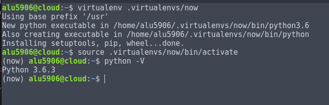
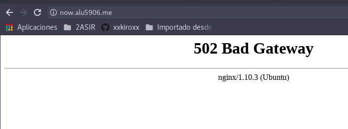

# UT1-A4: Sirviendo aplicaciones PHP y Python

- [1. Sitio Web 1](#1)

	- [1.1 Subir fichero demo_php al Cloud](#2)

	- [1.2 Creamos un fichero de Virtual Host](#3)

	- [1.3 Comprobación de la Página Web http://php.alu5906.me](#4)


- [Sitio Web 2](#5)

	- [2.1 Creación del Entorno Virtual](#6)

	- [2.2 Configuración fichero uWSGI](#7)

	- [2.3 Creación de Virtual Host](#8)

	- [2.4 Configuración de ficheros de supervisor](#9)


## Sitio Web 1<a name="1"></a>

El objetivo de la práctica es que al escribir la siguiente dirección [http://php.alu5906.me](http://php.alu5906.me) y que muestre la aplicación demo_php.zip


### 1.1 Subir fichero demo_php al Cloud<a name="2"></a>

Utilizamos el comando `scp -r "Descargas/demo_php" "cloud:"`


Comprobación del fichero está subido en el cloud.


Cambiamos el nombre del demo_php a php.

```console
alu5906@cloud:~$ mv demo_php/ php
alu5906@cloud:~$ ls -l
total 1588
-rw-rw-r-- 1 alu5906 alu5906 1595408 oct 16 12:44 get-pip.py
drwxrwxr-x 3 alu5906 alu5906    4096 oct 20 11:36 hellopython
-rw-rw-r-- 1 alu5906 alu5906      66 sep 25 15:34 index.html
drwxr-xr-x 3 alu5906 alu5906    4096 oct 20 12:39 php
drwxr-xr-x 4 alu5906 alu5906    4096 sep 25 15:30 series
drwxr-xr-x 2 alu5906 alu5906    4096 oct  2 12:03 shared
-rw-rw-r-- 1 alu5906 alu5906      23 oct 16 11:23 test.php
drwxrwxr-x 8 alu5906 alu5906    4096 oct  8 13:14 webapps
alu5906@cloud:~$

```
### 1.2 Creamos un fichero de Virtual Host<a name="3"></a>

Solo tenemos que crear un fichero nuevo llamado `php` en la ruta `/etc/nginx/sities-available`

```console
alu5906@cloud:~$ sudo nano /etc/nginx/sites-available/php
[sudo] password for alu5906:
alu5906@cloud:~$ cat /etc/nginx/sites-available/php
server {
	server_name php.alu5906.me;
	index index.php;
	root /home/alu5906/php;
	location ~ \.php$ {
		include snippets/fastcgi-php.conf;
		fastcgi_pass unix:/run/php/php7.0-fpm.sock;
	}
}
alu5906@cloud:~$ sudo ln -s /etc/nginx/sites-available/php /etc/nginx/sites-enabled/
```


- Necesitamos reiniciar el servicio

```console
alu5906@cloud:~$ sudo systemctl reload nginx.service
alu5906@cloud:~$ sudo systemctl status nginx.service
● nginx.service - A high performance web server and a reverse proxy server
   Loaded: loaded (/lib/systemd/system/nginx.service; enabled; vendor preset: en
   Active: active (running) (Result: exit-code) since lun 2017-09-25 11:31:01 UT
  Process: 4998 ExecReload=/usr/sbin/nginx -g daemon on; master_process on; -s r
 Main PID: 19141 (nginx)
    Tasks: 2
   Memory: 5.6M
      CPU: 4.262s
   CGroup: /system.slice/nginx.service
           ├─ 5002 nginx: worker process                           
           └─19141 nginx: master process /usr/sbin/nginx -g daemon on; master_pr

oct 20 12:48:42 cloud systemd[1]: Reloading A high performance web server and a
oct 20 12:48:42 cloud systemd[1]: Reloaded A high performance web server and a r
oct 20 14:29:21 cloud systemd[1]: Reloading A high performance web server and a
oct 20 14:29:21 cloud systemd[1]: Reloaded A high performance web server and a r
Warning: Journal has been rotated since unit was started. Log output is incomple
lines 1-17

```


### 1.3 Comprobación de la Página Web<a name="4"></a> [http://php.alu5906.me](http://php.alu5906.me)

[](http://php.alu5906.me)

## Sitio Web 2<a name="5"></a>

### 2.1 Creación del Entorno virtual<a name="6"></a>

Ya tenemos instalado de anterior prácticas el entorno virtual llamado `virtualenv`.

Creamos la carpeta `now`.

```console
alu5906@cloud:~$ virtualenv .virtualenvs/now
Using base prefix '/usr'
New python executable in /home/alu5906/.virtualenvs/now/bin/python3.6
Also creating executable in /home/alu5906/.virtualenvs/now/bin/python
Installing setuptools, pip, wheel...done.
alu5906@cloud:~$ source .virtualenvs/now/bin/activate
(now) alu5906@cloud:~$ python -V
Python 3.6.3
(now) alu5906@cloud:~$

```



- Instalación del gestor de paquetes de python `pip`

```console

(now) alu5906@cloud:~$ pip install uwsgi
Collecting uwsgi
Installing collected packages: uwsgi
Successfully installed uwsgi-2.0.15
(now) alu5906@cloud:~$

```

- Instalación de mini-framework para el desarrollo web `flask`

```console

(now) alu5906@cloud:~$ pip install flask
Collecting flask
  Using cached Flask-0.12.2-py2.py3-none-any.whl
Collecting Werkzeug>=0.7 (from flask)
  Using cached Werkzeug-0.12.2-py2.py3-none-any.whl
Collecting itsdangerous>=0.21 (from flask)
Collecting click>=2.0 (from flask)
  Using cached click-6.7-py2.py3-none-any.whl
Collecting Jinja2>=2.4 (from flask)
  Using cached Jinja2-2.9.6-py2.py3-none-any.whl
Collecting MarkupSafe>=0.23 (from Jinja2>=2.4->flask)
Installing collected packages: Werkzeug, itsdangerous, click, MarkupSafe, Jinja2, flask
Successfully installed Jinja2-2.9.6 MarkupSafe-1.0 Werkzeug-0.12.2 click-6.7 flask-0.12.2 itsdangerous-0.24
(now) alu5906@cloud:~$

```

- Creación de la carpeta now en `/home/alu5906/now`

```console

(now) alu5906@cloud:~$ mkdir now
(now) alu5906@cloud:~$ cd now/
(now) alu5906@cloud:~/now$ nano main.py
(now) alu5906@cloud:~/now$ cat main.py
import datetime
from flask import Flask
app = Flask(__name__)

@app.route("/")
def hello():
    return """
    <h1>Testing Python over Nginx</h1>
    Today is: {today}
    <br>
    Now is: {now}
    """.format(
        today=datetime.datetime.now().strftime("%d/%m/%Y"),
        now=datetime.datetime.now().strftime("%H:%mh")
    )
(now) alu5906@cloud:~/now$
```

- Con el siguiente comando `uwsgi --socket 0.0.0.0:8080 --protocol=http -w main:app` comprobamos que tenemos funcionando la aplicación.

```console
(now) alu5906@cloud:~/now$ uwsgi --socket 0.0.0.0:8080 --protocol=http -w main:app
*** Starting uWSGI 2.0.15 (64bit) on [Fri Oct 20 15:00:05 2017] ***
compiled with version: 5.4.0 20160609 on 16 October 2017 12:50:48
os: Linux-4.4.0-93-generic #116-Ubuntu SMP Fri Aug 11 21:17:51 UTC 2017
nodename: cloud
machine: x86_64
clock source: unix
detected number of CPU cores: 1
current working directory: /home/alu5906/now
detected binary path: /home/alu5906/.virtualenvs/now/bin/uwsgi
!!! no internal routing support, rebuild with pcre support !!!
*** WARNING: you are running uWSGI without its master process manager ***
your processes number limit is 1897
your memory page size is 4096 bytes
detected max file descriptor number: 1024
lock engine: pthread robust mutexes
thunder lock: disabled (you can enable it with --thunder-lock)
uwsgi socket 0 bound to TCP address 0.0.0.0:8080 fd 3
Python version: 3.6.3 (default, Oct  6 2017, 08:44:35)  [GCC 5.4.0 20160609]
*** Python threads support is disabled. You can enable it with --enable-threads ***
Python main interpreter initialized at 0x2251320
your server socket listen backlog is limited to 100 connections
your mercy for graceful operations on workers is 60 seconds
mapped 72760 bytes (71 KB) for 1 cores
*** Operational MODE: single process ***
WSGI app 0 (mountpoint='') ready in 0 seconds on interpreter 0x2251320 pid: 5251 (default app)
*** uWSGI is running in multiple interpreter mode ***
spawned uWSGI worker 1 (and the only) (pid: 5251, cores: 1)
[pid: 5251|app: 0|req: 1/1] 88.16.204.199 () {34 vars in 597 bytes} [Fri Oct 20 15:00:07 2017] GET / => generated 97 bytes in 1 msecs (HTTP/1.1 200) 2 headers in 79 bytes (1 switches on core 0)
[pid: 5251|app: 0|req: 2/2] 88.16.204.199 () {34 vars in 597 bytes} [Fri Oct 20 15:00:07 2017] GET / => generated 97 bytes in 0 msecs (HTTP/1.1 200) 2 headers in 79 bytes (1 switches on core 0)
[pid: 5251|app: 0|req: 3/3] 88.16.204.199 () {36 vars in 599 bytes} [Fri Oct 20 15:00:08 2017] GET /favicon.ico => generated 233 bytes in 13 msecs (HTTP/1.1 404) 2 headers in 72 bytes (1 switches on core 0)
[pid: 5251|app: 0|req: 4/4] 88.16.204.199 () {34 vars in 597 bytes} [Fri Oct 20 15:00:09 2017] GET / => generated 97 bytes in 0 msecs (HTTP/1.1 200) 2 headers in 79 bytes (1 switches on core 0)
[pid: 5251|app: 0|req: 5/5] 88.16.204.199 () {34 vars in 597 bytes} [Fri Oct 20 15:00:10 2017] GET / => generated 97 bytes in 0 msecs (HTTP/1.1 200) 2 headers in 79 bytes (1 switches on core 0)
[pid: 5251|app: 0|req: 6/6] 88.16.204.199 () {34 vars in 597 bytes} [Fri Oct 20 15:00:10 2017] GET / => generated 97 bytes in 0 msecs (HTTP/1.1 200) 2 headers in 79 bytes (1 switches on core 0)
[pid: 5251|app: 0|req: 7/7] 88.16.204.199 () {34 vars in 597 bytes} [Fri Oct 20 15:00:11 2017] GET / => generated 97 bytes in 0 msecs (HTTP/1.1 200) 2 headers in 79 bytes (1 switches on core 0)
[pid: 5251|app: 0|req: 8/8] 88.16.204.199 () {34 vars in 597 bytes} [Fri Oct 20 15:00:11 2017] GET / => generated 97 bytes in 0 msecs (HTTP/1.1 200) 2 headers in 79 bytes (1 switches on core 0)
[pid: 5251|app: 0|req: 9/9] 88.16.204.199 () {34 vars in 597 bytes} [Fri Oct 20 15:00:11 2017] GET / => generated 97 bytes in 0 msecs (HTTP/1.1 200) 2 headers in 79 bytes (1 switches on core 0)
[pid: 5251|app: 0|req: 10/10] 88.16.204.199 () {34 vars in 597 bytes} [Fri Oct 20 15:00:12 2017] GET / => generated 97 bytes in 0 msecs (HTTP/1.1 200) 2 headers in 79 bytes (1 switches on core 0)
[pid: 5251|app: 0|req: 11/11] 88.16.204.199 () {34 vars in 597 bytes} [Fri Oct 20 15:00:12 2017] GET / => generated 97 bytes in 0 msecs (HTTP/1.1 200) 2 headers in 79 bytes (1 switches on core 0)
[pid: 5251|app: 0|req: 12/12] 88.16.204.199 () {34 vars in 597 bytes} [Fri Oct 20 15:00:13 2017] GET / => generated 97 bytes in 0 msecs (HTTP/1.1 200) 2 headers in 79 bytes (1 switches on core 0)
^C(now) alu5906@cloud:~/now$


```


### 2.2 Configuración fichero uWSGI<a name="7"></a>

```console

(now) alu5906@cloud:~/now$ nano uwsgi.ini
(now) alu5906@cloud:~/now$ cat uwsgi.ini
[uwsgi]
chdir = /home/alu5906/now
module = main:app
master = true
processes = 1
socket = /tmp/now.sock
chmod-socket = 666
vacuum = true
(now) alu5906@cloud:~/now$
```

- Creación de fichero `run.sh`.

```console
(now) alu5906@cloud:~/now$ nano uwsgi.ini
(now) alu5906@cloud:~/now$ nano run.py
(now) alu5906@cloud:~/now$ ls
main.py  __pycache__  run.sh  uwsgi.ini
(now) alu5906@cloud:~/now$ chmod +x run.sh
(now) alu5906@cloud:~/now$ ls -l run.sh
-rwxrwxr-x 1 alu5906 alu5906 104 oct 20 15:10 run.sh
(now) alu5906@cloud:~/now$ cat run.sh
#!/bin/bash

source /home/alu5906/.virtualenvs/now/bin/activate
uwsgi --ini /home/alu5906/now/uwsgi.ini
(now) alu5906@cloud:~/now$

```

### 2.3 Creación de Virtual Host<a name="8"></a>

Vamos a crear un virtual host para nuesta aplicación de python y que responda a la petición de la url `[http://now.alu5906.me](http://now.alu5906.me)`


```console
(now) alu5906@cloud:~/now$ sudo nano /etc/nginx/sites-available/now
[sudo] password for alu5906:
(now) alu5906@cloud:~/now$ deactivate
alu5906@cloud:~/now$ sudo ln -s /etc/nginx/sites-available/now /etc/nginx/sites-enabled/
alu5906@cloud:~/now$ sudo systemctl reload nginx.service
alu5906@cloud:~/now$ sudo systemctl status nginx.service
● nginx.service - A high performance web server and a reverse proxy server
   Loaded: loaded (/lib/systemd/system/nginx.service; enabled; vendor preset: en
   Active: active (running) (Result: exit-code) since lun 2017-09-25 11:31:01 UT
  Process: 5469 ExecReload=/usr/sbin/nginx -g daemon on; master_process on; -s r
 Main PID: 19141 (nginx)
    Tasks: 2
   Memory: 5.4M
      CPU: 4.285s
   CGroup: /system.slice/nginx.service
           ├─ 5473 nginx: worker process                           
           └─19141 nginx: master process /usr/sbin/nginx -g daemon on; master_pr

oct 20 12:48:42 cloud systemd[1]: Reloading A high performance web server and a
oct 20 12:48:42 cloud systemd[1]: Reloaded A high performance web server and a r
oct 20 14:29:21 cloud systemd[1]: Reloading A high performance web server and a
oct 20 14:29:21 cloud systemd[1]: Reloaded A high performance web server and a r
oct 20 15:19:31 cloud systemd[1]: Reloading A high performance web server and a
alu5906@cloud:~/now$ cat /etc/nginx/sites-available/now
server {
    server_name now.alu5906.me;

    location / {
        include uwsgi_params;
        uwsgi_pass unix:/tmp/now.sock;   # socket definido en uwsgi.ini
    }

    location /static {
        root /home/alu5906/now;         # para servir ficheros estáticos
    }
}
alu5906@cloud:~/now$ ls -l /etc/nginx/sites-enabled/now
lrwxrwxrwx 1 root root 30 oct 20 15:19 /etc/nginx/sites-enabled/now -> /etc/nginx/sites-available/now
alu5906@cloud:~/now$

```

- Comprobamos la página sin ejecutar el fichero `run.sh`


- Ejecutamos el fichero `run.sh`


### 2.4 Configuración de ficheros de supervisor<a name="9"></a>

El programa que tenemos en la ruta `/home/alu5906/now/main.py` queremos con el programa de supervisor gestione cuando se debe parar, cuando debe iniciar.

```console
alu5906@cloud:~/now$ sudo nano /etc/supervisor/conf.d/now.conf
alu5906@cloud:~/now$ sudo cat /etc/supervisor/conf.d/now.conf
[program:now]
user = alu5906
command = /home/alu5906/now/run.sh
autostart = true
autorestart = true
stopsignal = INT
killasgroup = true
stderr_logfile = /home/alu5906/now/now.err.log
stdout_logfile = /home/alu5906/now/now.out.log
alu5906@cloud:~/now$

```

- En caso de que tengamos problemas al ejecutar el siguiente comando `supervisorctl status`, el mensaje sea problemas de permisos. Debemos realizar los siguientes paso.

- Crear un grupo.

- Modificar el fichero de configuración de `supervisord.conf`, solo debemos añadir dos líneas, fijarse en el código de abajo.

```console
alu5906@cloud:~/now$ sudo groupadd supervisorctl
alu5906@cloud:~$ sudo cat /etc/supervisor/supervisord.conf | grep chmod
chmod=0770                       ; sockef file mode (default 0700)
alu5906@cloud:~$ sudo cat /etc/supervisor/supervisord.conf | grep chown
chown=root:supervisor		; grupo 'supervisor' para usuarios no privilegiados
alu5906@cloud:~$

```

- Al final de terminar todo es importante reiniciar el servicio de supervisor.

```console
alu5906@cloud:~$ sudo systemctl restart supervisor.service
alu5906@cloud:~$ sudo systemctl status supervisor.service
● supervisor.service - Supervisor process control system for UNIX
   Loaded: loaded (/lib/systemd/system/supervisor.service; enabled; vendor prese
   Active: active (running) since vie 2017-10-20 15:37:49 UTC; 58s ago
     Docs: http://supervisord.org
  Process: 5660 ExecStop=/usr/bin/supervisorctl $OPTIONS shutdown (code=exited,
 Main PID: 5666 (supervisord)
    Tasks: 7
   Memory: 48.7M
      CPU: 1.078s
   CGroup: /system.slice/supervisor.service
           ├─5666 /usr/bin/python /usr/bin/supervisord -n -c /etc/supervisor/sup
           ├─5672 /bin/bash /home/alu5906/now/run.sh
           ├─5673 /bin/bash /home/alu5906/hellopython/run.sh
           ├─5678 uwsgi --ini /home/alu5906/hellopython/uwsgi.ini
           ├─5679 uwsgi --ini /home/alu5906/now/uwsgi.ini
           ├─5682 uwsgi --ini /home/alu5906/now/uwsgi.ini
           └─5683 uwsgi --ini /home/alu5906/hellopython/uwsgi.ini
alu5906@cloud:~$

```

$ supervisorctl status


$ supervisorctl start now


$ supervisorctl stop now




$ supervisorctl restart now


- Se comprueba que la página del sitio Web 1 [http://php.alu5906.me](http://php.alu5906.me) funcione correctamente con el programa de python.

- Se comprueba que la página del sitio Web 2 [http://now.alu5906.me](http://now.alu5906.me) funcione correctamente con el programa de python.
