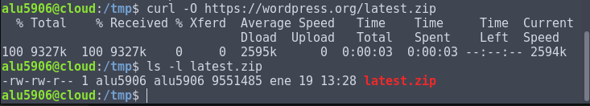
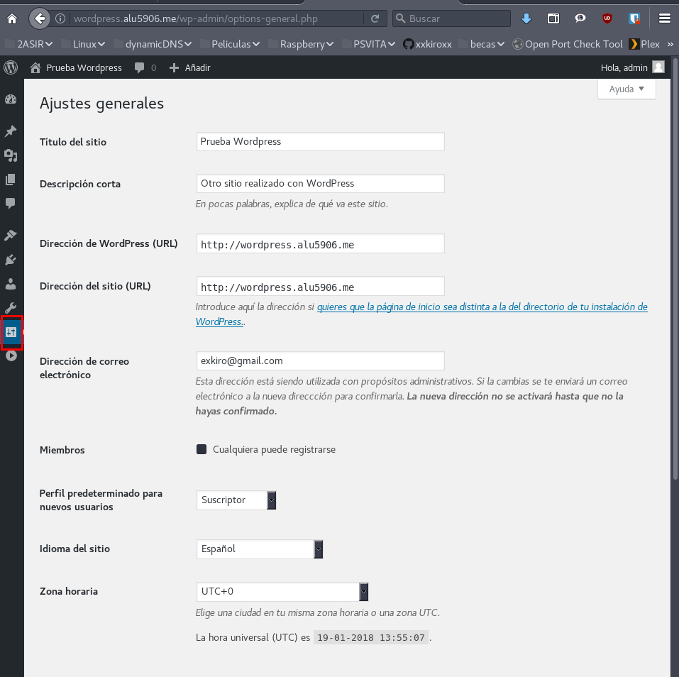

# WordPress

- [1. Configuración Base de datos MySQL para WordPress](#1)
- [2. Descargar WordPress desde su página Web](#2)
    - [2.1 Mover el directorio WordPress a `/usr/share`](#4)
    - [2.2 Permisos para el directorio WordPress](#5)
    - [2.3 Configurar fichero de configuración `wp-config.php`](#6)
- [3. Creación de Virtual Host con el Nginx](#7)
- [4. Configuración del sitio WordPress vía Web](#8)
- [5. Acceder a WordPress](#3)
- [6. Personalizar el Tema de WordPress](#9)
- [7. Ajustar los permalinks a "Día y Nombre"](#10)
- [8. Escribir un post con las estadísticas de uso de "WordPress"](#11)

## 1. Configuración Base de datos MySQL para WordPress 

Tenemos que abrir una terminal nueva y debemos escribir el siguiente comando para acceder a nuestra base de datos `MySQL`

- `mysql -u root -p`

- Tenemos que crear una base de datos en este caso la llamamos `wpdatabase`.

- Creamos un usuario llamado `wpuser`

- Al usuario creado `wpuser` le damos permiso con control total para la base de datos creada `wpdatabase`

## 2. Descargar WordPress desde su página Web 

Podemos acceder a la página de [`WordPress`](https://es.wordpress.org/txt-download/) y podemos descargar la aplicación.

Primero vamos al directorio de archivos temporales de `Ubuntu -> /tmp`

En nuestro caso vamos a utilizar el comando `curl -O`.

Descomprimimos el fichero descargado `latest.zip` en `/tmp`

### 2.1 Mover el directorio WordPress a `/usr/share` 

Copiamos el fichero descomprimido `WordPress` y a la siguiente ruta `/usr/share`

Comprobamos que el directorio está copiado en la ruta `/usr/share`

### 2.2 Permisos para el directorio WordPress 

Si nos fijamos el directorio está con permisos de `root` tanto de usuario como de grupo.

- Tenemos que cambiar el permiso de usuario y grupo de `root` a `www-data`

Comprobamos que se cambio correctamente los permisos para el usuario y grupo `www-data`

### 2.3 Configurar fichero de configuración `wp-config.php` 

Tenemos que modificar el fichero que esta dentro del directorio de `wordpress` por lo tanto tenemos que ir a su ruta `/usr/share/wordpress`.

Realizamos una copia del fichero de configuración `wp-config-sample.php` a `wp-config.php`

Modificamos el fichero y tenemos que buscar las líneas:

- DB_NAME: `Nombre Base de Datos de WordPress`
- DB_USER: `Usuario de la Base Datos para WordPress`
- DB_PASSWORD: `Contraseña del usuario`
- DB_CHARSET: `utf8m4`

## 3. Creación de Virtual Host con el Nginx 

Tenemos que crear un nuevo virtual host en `nginx` para la instalación de nuestro `wordpress`.

- Vamos a la siguiente ruta `/etc/nginx/sites-available`.
- Creamos el virtual host con el nombre de `wordpress`

- Solo nos faltas crear un enlace simbólico en la siguiente ruta `/etc/nginx/sites-enabled`

- Comprobamos que está creado el enlace simbólico.

- Tenemos que reiniciar o recargar el servicio de `nginx.service`

## 4. Configuración del sitio WordPress vía Web 

Solo tenemos que ir a nuestro navegador y escribimos en el url [`wordpress.alu5906.me`](http://wordpress.alu5906.me).

Nos saldrá qué tenemos que seleccionar el idioma, en nuestro caso el `español`, le damos continuar.

Tenemos un formulario con la siguiente información.

- Título del sitio: `Establecer el nombre que nosotros queramos`.
- Nombre de Usuario: `Establecemos el nombre para el administrador de WordPress`
- Contraseña: `Contraseña para el usuario administrador`
- Correo: `Escribir nuestro correo electrónico`

Ya tenemos instalado y configurado nuestro `WordPress` en nuestro servidor `Ubuntu`.

## 5. Acceder a WordPress 

Solo tenemos que escribir en nuestro navegador la siguiente url [`wordpress.alu5906.me/wp-login.php`](http://wordpress.alu5906.me/wp-login.php)

- Solo escribimos el usuario `admin` con su contraseña.

Accedemos a nuestro `WordPress` aquí podemos modificar todo.

## 6. Personalizar el Tema de WordPress 

Solo tenemos que ir a cambiar tu tema por completo.

- Seleccionamos un tema en mi caso es el siguiente.

- Vamos a `Temas` y Seleccionamos el tema descargado

## 7. Ajustar los permalinks a "Día y Nombre" 

Tenemos que ir a `Ajustes -> enlaces permanentes`

- Seleccionamos el `día y nombre`

## 8. Escribir un post con las estadísticas de uso de "WordPress" 

