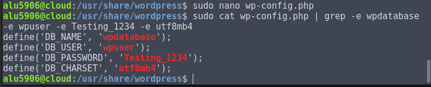
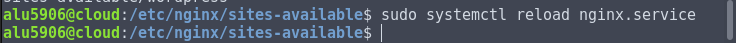

# WordPress


- [1. Configuración Base de datos MySQL para WordPress](#1)
- [2. Descargar WordPress desde su página Web](#2)
    - [2.1 Mover el directorio WordPress a `/usr/share`](#4)
    - [2.2 Permisos para el directorio WordPress](#5)
    - [2.3 Configurar fichero de configuración `wp-config.php`](#6)
- [3. Creación de Virtual Host con el Nginx](#7)
- [4. Configuración del sitio WordPress vía Web](#8)
- [5. Acceder a WordPress](#3)
- [6. Límite de tamaño en la subida de archivos](#13)
- [7. Estructura de ficheros](#12)
- [8. Personalizar el Tema de WordPress](#9)
- [9. Ajustar los permalinks a "Día y Nombre"](#10)
- [10. Escribir un post con las estadísticas de uso de "WordPress"](#11)


## 1. Configuración Base de datos MySQL para WordPress <a name=1></a>

Tenemos que abrir una terminal nueva y debemos escribir el siguiente comando para acceder a nuestra base de datos `MySQL`

- `mysql -u root -p`


- Tenemos que crear una base de datos en este caso la llamamos `wpdatabase`.


- Creamos un usuario llamado `wpuser`


- Al usuario creado `wpuser` le damos permiso con control total para la base de datos creada `wpdatabase`


## 2. Descargar WordPress desde su página Web <a name=2></a>

Podemos acceder a la página de [`WordPress`](https://es.wordpress.org/txt-download/) y podemos descargar la aplicación.


Primero vamos al directorio de archivos temporales de `Ubuntu -> /tmp`


En nuestro caso vamos a utilizar el comando `curl -O`.


Descomprimimos el fichero descargado `latest.zip` en `/tmp`


### 2.1 Mover el directorio WordPress a `/usr/share` <a name=4></a>

Copiamos el fichero descomprimido `WordPress` y a la siguiente ruta `/usr/share`


Comprobamos que el directorio está copiado en la ruta `/usr/share`


### 2.2 Permisos para el directorio WordPress <a name=5></a>

Si nos fijamos el directorio está con permisos de `root` tanto de usuario como de grupo.

- Tenemos que cambiar el permiso de usuario y grupo de `root` a `www-data`


Comprobamos que se cambio correctamente los permisos para el usuario y grupo `www-data`


### 2.3 Configurar fichero de configuración `wp-config.php` <a name=6></a>

Tenemos que modificar el fichero que esta dentro del directorio de `wordpress` por lo tanto tenemos que ir a su ruta `/usr/share/wordpress`.


Realizamos una copia del fichero de configuración `wp-config-sample.php` a `wp-config.php`


Modificamos el fichero y tenemos que buscar las líneas:

- DB_NAME: `Nombre Base de Datos de WordPress`
- DB_USER: `Usuario de la Base Datos para WordPress`
- DB_PASSWORD: `Contraseña del usuario`
- DB_CHARSET: `utf8m4`



## 3. Creación de Virtual Host con el Nginx <a name=7></a>

Tenemos que crear un nuevo virtual host en `nginx` para la instalación de nuestro `wordpress`.

- Vamos a la siguiente ruta `/etc/nginx/sites-available`.
- Creamos el virtual host con el nombre de `wordpress`


- Solo nos faltas crear un enlace simbólico en la siguiente ruta `/etc/nginx/sites-enabled`


- Comprobamos que está creado el enlace simbólico.


- Tenemos que reiniciar o recargar el servicio de `nginx.service`



- Ahora debemos indicar a nginx que procese estar URLs:


## 4. Configuración del sitio WordPress vía Web <a name=8></a>

Solo tenemos que ir a nuestro navegador y escribimos en el url [`wordpress.alu5906.me`](http://wordpress.alu5906.me).

Nos saldrá qué tenemos que seleccionar el idioma, en nuestro caso el `español`, le damos continuar.


Tenemos un formulario con la siguiente información.

- Título del sitio: `Establecer el nombre que nosotros queramos`.
- Nombre de Usuario: `Establecemos el nombre para el administrador de WordPress`
- Contraseña: `Contraseña para el usuario administrador`
- Correo: `Escribir nuestro correo electrónico`


Ya tenemos instalado y configurado nuestro `WordPress` en nuestro servidor `Ubuntu`.


## 5. Acceder a WordPress <a name=3></a>

Solo tenemos que escribir en nuestro navegador la siguiente url [`wordpress.alu5906.me/wp-login.php`](http://wordpress.alu5906.me/wp-login.php)

- Solo escribimos el usuario `admin` con su contraseña.


Accedemos a nuestro `WordPress` aquí podemos modificar todo.


## 6. Límite de tamaño en la subida de archivos<a name=13></a>

Por defecto, el límite de subida de archivos para aplicaciones PHP suele ser bastante bajo, en torno a los 2MB.


Reiniciamos el servicio de php7


Además de esto, debemos añadir una línea en el fichero de configuración de Nginx:


Reiniciamos el servicio de nginx.


## 7. Estructura de ficheros<a name=12></a>

```console
alu5906@cloud:~$ tree -d /usr/share/wordpress/
/usr/share/wordpress/
├── wp-admin
│   ├── css
│   │   └── colors
│   │       ├── blue
│   │       ├── coffee
│   │       ├── ectoplasm
│   │       ├── light
│   │       ├── midnight
│   │       ├── ocean
│   │       └── sunrise
│   ├── images
│   ├── includes
│   ├── js
│   │   └── widgets
│   ├── maint
│   ├── network
│   └── user
├── wp-content
│   ├── languages
│   │   ├── plugins
│   │   └── themes
│   ├── plugins
│   │   └── akismet
│   │       ├── _inc
│   │       │   └── img
│   │       └── views
│   ├── themes
│   │   ├── appointment
│   │   │   ├── css
│   │   │   │   └── font-awesome
│   │   │   │       ├── css
│   │   │   │       ├── fonts
│   │   │   │       ├── less
│   │   │   │       └── scss
│   │   │   ├── functions
│   │   │   │   ├── appointment-info
│   │   │   │   │   ├── css
│   │   │   │   │   ├── img
│   │   │   │   │   ├── js
│   │   │   │   │   └── sections
│   │   │   │   ├── breadcrumbs
│   │   │   │   ├── custom-controls
│   │   │   │   │   └── select
│   │   │   │   ├── customizer
│   │   │   │   ├── font
│   │   │   │   ├── lang
│   │   │   │   ├── menu
│   │   │   │   ├── scripts
│   │   │   │   └── widgets
│   │   │   ├── images
│   │   │   │   ├── color
│   │   │   │   └── slide
│   │   │   └── js
│   │   │       └── menu
│   │   ├── appointment-red
│   │   │   ├── css
│   │   │   ├── images
│   │   │   └── languages
│   │   ├── fashify
│   │   │   ├── assets
│   │   │   │   ├── css
│   │   │   │   ├── fonts
│   │   │   │   ├── js
│   │   │   │   └── sass
│   │   │   ├── inc
│   │   │   └── template-parts
│   │   ├── twentyfifteen
│   │   │   ├── css
│   │   │   ├── genericons
│   │   │   ├── inc
│   │   │   └── js
│   │   ├── twentyseventeen
│   │   │   ├── assets
│   │   │   │   ├── css
│   │   │   │   ├── images
│   │   │   │   └── js
│   │   │   ├── inc
│   │   │   └── template-parts
│   │   │       ├── footer
│   │   │       ├── header
│   │   │       ├── navigation
│   │   │       ├── page
│   │   │       └── post
│   │   └── twentysixteen
│   │       ├── css
│   │       ├── genericons
│   │       ├── inc
│   │       ├── js
│   │       └── template-parts
│   ├── upgrade
│   └── uploads
│       └── 2018
│           └── 01
└── wp-includes
    ├── certificates
    ├── css
    ├── customize
    ├── fonts
    ├── ID3
    ├── images
    │   ├── crystal
    │   ├── media
    │   ├── smilies
    │   └── wlw
    ├── IXR
    ├── js
    │   ├── codemirror
    │   ├── crop
    │   ├── imgareaselect
    │   ├── jcrop
    │   ├── jquery
    │   │   └── ui
    │   ├── mediaelement
    │   │   └── renderers
    │   ├── plupload
    │   ├── swfupload
    │   ├── thickbox
    │   └── tinymce
    │       ├── langs
    │       ├── plugins
    │       │   ├── charmap
    │       │   ├── colorpicker
    │       │   ├── compat3x
    │       │   │   └── css
    │       │   ├── directionality
    │       │   ├── fullscreen
    │       │   ├── hr
    │       │   ├── image
    │       │   ├── link
    │       │   ├── lists
    │       │   ├── media
    │       │   ├── paste
    │       │   ├── tabfocus
    │       │   ├── textcolor
    │       │   ├── wordpress
    │       │   ├── wpautoresize
    │       │   ├── wpdialogs
    │       │   ├── wpeditimage
    │       │   ├── wpemoji
    │       │   ├── wpgallery
    │       │   ├── wplink
    │       │   ├── wptextpattern
    │       │   └── wpview
    │       ├── skins
    │       │   ├── lightgray
    │       │   │   ├── fonts
    │       │   │   └── img
    │       │   └── wordpress
    │       │       └── images
    │       ├── themes
    │       │   ├── inlite
    │       │   └── modern
    │       └── utils
    ├── pomo
    ├── random_compat
    ├── Requests
    │   ├── Auth
    │   ├── Cookie
    │   ├── Exception
    │   │   ├── HTTP
    │   │   └── Transport
    │   ├── Proxy
    │   ├── Response
    │   ├── Transport
    │   └── Utility
    ├── rest-api
    │   ├── endpoints
    │   └── fields
    ├── SimplePie
    │   ├── Cache
    │   ├── Content
    │   │   └── Type
    │   ├── Decode
    │   │   └── HTML
    │   ├── HTTP
    │   ├── Net
    │   ├── Parse
    │   └── XML
    │       └── Declaration
    ├── Text
    │   └── Diff
    │       ├── Engine
    │       └── Renderer
    ├── theme-compat
    └── widgets

185 directories
alu5906@cloud:~$
```

## 8. Personalizar el Tema de WordPress <a name=9></a>

Solo tenemos que ir a cambiar tu tema por completo.


- Seleccionamos un tema en mi caso es el siguiente.


- Vamos a `Temas` y Seleccionamos el tema descargado


## 9. Ajustar los permalinks a "Día y Nombre" <a name=10></a>

Tenemos que ir a `Ajustes -> enlaces permanentes`


- Seleccionamos el `día y nombre`


## 10. Escribir un post con las estadísticas de uso de "WordPress" <a name=11></a>

Abrimos el wordpress con el usuario `administrador` y vamos a `entradas -> añadir nueva`

Creamos una nuevo post llamado estadíticas de WordPress.


Luego visualizamos el resultado en la página.


