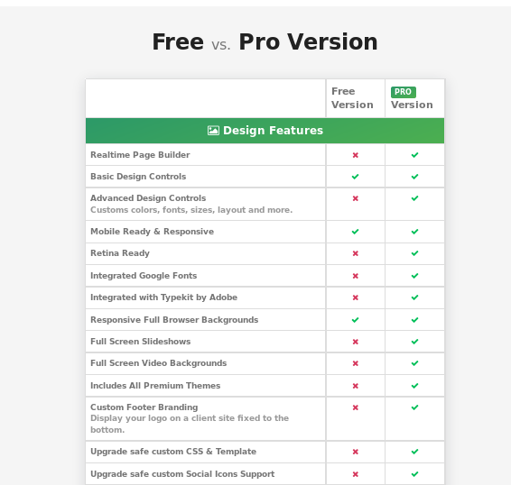
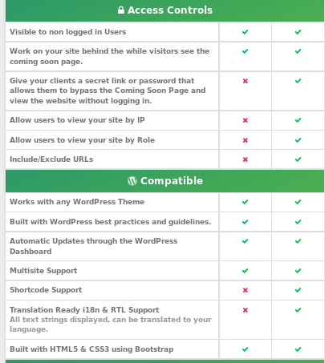

# Trabajo de Plugins de Wordpress

## 1. Descargar los Plugins

Tenemos que ir a la página de [Plugins Table](http://plugintable.com/) y tenemos que descargar los siguientes plugins.

Los que tenemos marcados en la tabla periódica de `Plugins WordPress` debemos descargarlos.

## 2. Plugin de Coming Soon Page & Maintenance

Esté plugins es muy sencillo su función es la de crear una página Web que indique un mensaje como que está en construcción o en mantenimiento. Puedes diseñar esa página con el Plugins. Por lo tanto puedes trabajar con tu página de `WordPress` sin que nadie pueda visualizar su contenido hasta que este terminada.

En la página Web de [Plugins Table](http://plugintable.com/) seleccionamos el número `51` y se nos muestra una nueva ventana y nos muestra información del plugins.

En este caso vamos a descargar el plugins.

Ya lo tenemos descargado, para instalar el plugins en el `WordPress` vamos a `Ajustes -> añadir Plugins`.

- Le damos a `subir plugin`

Seleccionamos `Examinar` y buscamos en nuestro disco duro el plugins descargado.

El `Plugins` debe subirse comprimido. No necesitas descomprimirlo.

Comprobamos que ya se esta descomprimiendo y instalando.

- Comprobamos los Plugins Instalados `Plugins -> Plugins Instalados `

Para entrar al plugins y configurar la página Web de mantenimiento solo debemos ir a `Ajustes -> Coming Soon Pages`

En este plugins nos indica diferentes forma de seleccionar el `Estado`.

Luego las demás funciones son para editar la página Web de Mantenimiento como nosotros queramos.

Si aplicamos o seleccionamos el `Estado` en modo mantenimiento y vemos que es lo que sucede cuando un `Internauta` intenta mirar la página Web.

El plugins es una versión ligera, pero tiene una versión `Premiun` de pago con muchas mas funciones para la hora de editar la página.

Si le damos clic a la [Mejora Premiun](https://www.seedprod.com/ultimate-coming-soon-page-vs-coming-soon-pro/?utm_source=coming-soon-plugin&utm_medium=banner&utm_campaign=coming-soon-link-in-plugin) veremos la diferencia entre la versión ligera y la premiun.

- Vemos la diferencia entre la versión `Free` y la `Pro` en este es el diseño de la página y todo lo que podemos realizar según la versión.

- La siguientes para el marketing y la captura de datos.

- La siguiente Opción es para el control de Acceso y compatibilidad.

- La siguiente es para los iconos sociales.

El precio de la versión de pago es la siguiente.

## 3. Plugin TinyMCE-Advanced

En la página Web de [Plugins Table](http://plugintable.com/) seleccionamos el número `69 -> TinyMCE Advanced` y se nos muestra una nueva ventana y nos muestra información del plugins.

En este caso vamos a descargar el plugins.

Ya lo tenemos descargado, para instalar el plugins en el `WordPress` vamos a `Ajustes -> añadir Plugins`.

- Le damos a `subir plugin`

Seleccionamos `Examinar` y buscamos en nuestro disco duro el plugins descargado.

El `Plugin` debe subirse comprimido. No necesitas descomprimirlo.

Comprobamos que se esta instalado.

Para configurar el `Plugin` tenemos que ir a `Ajustes -> TinyMCE-Advanced`.

Como comprobamos el la imagen anterior esté plugin es bastante sencillo. Su función es facilitar al `autor` a la hora de crear `Post` por lo defecto es muy simple y si necesitas diseñar mas el `post` tiene que tirar de código `HTML` y por lo tanto es más complicado para las personas que desconocen dicho lenguajes de marca.
Por lo tanto este plugin es para facilitar ese Trabajo a la hora de crear nuevos `post` y tengas una facilidad a la hora de diseñarlo.

Este plugin es totalmente gratuito.

Vamos a ver un ejemplo de como se ve al crear un `post` con las utilidades nuevas del plugin.

Comprobamos que tenemos mas opciones a la hora de configurar el `post` ya que por defecto es muy simple.

Vemos la diferencia entre el por `Defecto` y el plugin `TinyMCE-Advanced`

- Por defecto

- Con la mejora del plugin `TinyMCE-Advanced`

