# Trabajo de Plugins de Wordpress

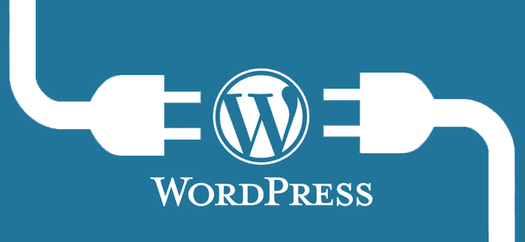

## 1. Descargar los Plugins

Tenemos que ir a la página de [Plugins Table](http://plugintable.com/) y tenemos que descargar los siguientes plugins.

Los que tenemos marcados en la tabla periódica de `Plugins WordPress` debemos descargarlos.

## 2. Plugin de Coming Soon Page & Maintenance

Esté plugins es muy sencillo su función es la de crear una página Web que indique un mensaje como que está en construcción o en mantenimiento. Puedes diseñar esa página con el Plugins. Por lo tanto puedes trabajar con tu página de `WordPress` sin que nadie pueda visualizar su contenido hasta que este terminada.

En la página Web de [Plugins Table](http://plugintable.com/) seleccionamos el número `51` y se nos muestra una nueva ventana y nos muestra información del plugin.

En este caso vamos a descargar el plugins.

Ya lo tenemos descargado, para instalar el plugins en el `WordPress` vamos a `Ajustes -> añadir Plugins`.

- Le damos a `subir plugin`

Seleccionamos `Examinar` y buscamos en nuestro disco duro el plugins descargado.

El `Plugins` debe subirse comprimido. No necesitas descomprimirlo.

Comprobamos que ya se esta descomprimiendo y instalando.

- Comprobamos los Plugins Instalados `Plugins -> Plugins Instalados `

La facilidad en la instalación es un 5 es muy fácil. Es decir solo necesitamos descargar el zip y instalar como indicamos en los pasos anteriores.

La facilidad de uso es bastante sencilla e intuitiva como explicaremos más adelante.

No necesita ningún requerimiento especifico ni instalación de paquetes dependientes para la instalación del plugin.

Para entrar al plugins y configurar la página Web de mantenimiento solo debemos ir a `Ajustes -> Coming Soon Pages`

En este plugins nos indica diferentes forma de seleccionar el `Estado`.

Luego las demás funciones son para editar la página Web de Mantenimiento como nosotros queramos.

Si aplicamos o seleccionamos el `Estado` en modo mantenimiento y vemos que es lo que sucede cuando un `Internauta` intenta mirar la página Web.

El plugins es una versión ligera, pero tiene una versión `Premiun` de pago con muchas mas funciones para la hora de editar la página.

Si le damos clic a la [Mejora Premiun](https://www.seedprod.com/ultimate-coming-soon-page-vs-coming-soon-pro/?utm_source=coming-soon-plugin&utm_medium=banner&utm_campaign=coming-soon-link-in-plugin) veremos la diferencia entre la versión ligera y la pro versión.

- Vemos la diferencia entre la versión `Free` y la `Pro` en este es el diseño de la página y todo lo que podemos realizar según la versión.

- La siguientes para el marketing y la captura de datos.

- La siguiente Opción es para el control de Acceso y compatibilidad.

- La siguiente es para los iconos sociales.

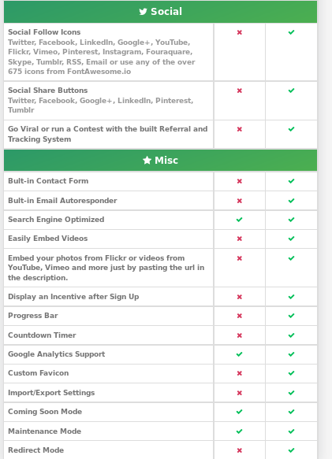

El precio de la versión de pago es la siguiente.

## 3. Plugin TinyMCE-Advanced

En la página Web de [Plugins Table](http://plugintable.com/) seleccionamos el número `69 -> TinyMCE Advanced` y se nos muestra una nueva ventana y nos muestra información del plugins.

En este caso vamos a descargar el plugins.

Ya lo tenemos descargado, para instalar el plugins en el `WordPress` vamos a `Ajustes -> añadir Plugins`.

- Le damos a `subir plugin`

Seleccionamos `Examinar` y buscamos en nuestro disco duro el plugins descargado.

El `Plugin` debe subirse comprimido. No necesitas descomprimirlo.

Comprobamos que se esta instalado.

Su instalación como hemos comprobado es sencilla y por lo tanto se lleva un 5 no tiene ninguna complicación.

Su facilidad de uso es increible porque mejora a los autores que puedan diseñar mejor los post o páginas.

No es necesario ningún requerimiento de instalación ni dependencia de paquetes para su instalación.

Para configurar el `Plugin` tenemos que ir a `Ajustes -> TinyMCE-Advanced`.

Como comprobamos el la imagen anterior esté plugin es bastante sencillo. Su función es facilitar al `autor` a la hora de crear `Post` por lo defecto es muy simple y si necesitas diseñar mas el `post` tiene que tirar de código `HTML` y por lo tanto es más complicado para las personas que desconocen dicho lenguajes de marca.
Por lo tanto este plugin es para facilitar ese Trabajo a la hora de crear nuevos `post` y tengas una facilidad a la hora de diseñarlo.

Este plugin es totalmente gratuito.

Vamos a ver un ejemplo de como se ve al crear un `post` con las utilidades nuevas del plugin.

Comprobamos que tenemos mas opciones a la hora de configurar el `post` ya que por defecto es muy simple.

Vemos la diferencia entre el por `Defecto` y el plugin `TinyMCE-Advanced`

- Por defecto

- Con la mejora del plugin `TinyMCE-Advanced`

## WPForm

### 1.Descripción.

Wordpress no incluye esta herramienta de forma nativa, pero exixten Plugins, que nos facilita crear formularios de una forma sencilla y muy visual como es en este caso WPForms.

### 2.Facilidad de instalación/activación (1 a 5).

Es un Plugin facil de instalar, parte del software es gratuito.

Una vez activado nos aparece en nuestro manu lateral.

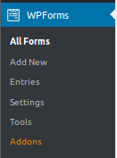

El costo del software completo, si queremos utilizar las demas plantillas.

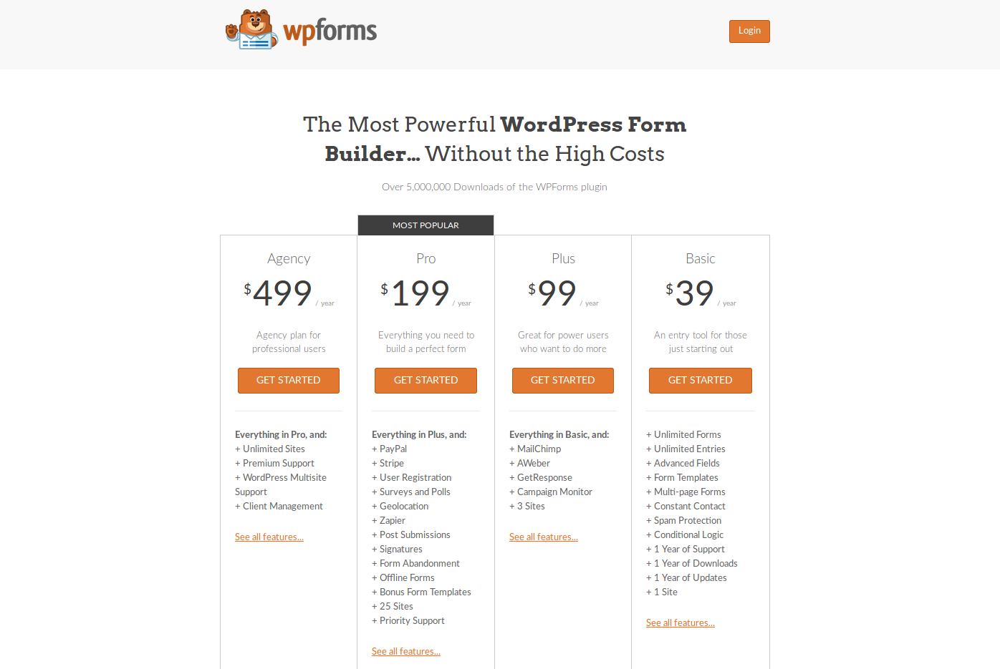

### 3.Facilidad de uso (1 a 5).

Es una herramienta muy intuitiva que se compone de 5 apartados.

* Setup

   En este apartado podemos poner nombre a nuestra plantilla y elegir entre tres **templates** que dispone la version gratuita; estos templates son:

    

* Black Form:

  Es un formulario en blaco para deseñar uno a tus necesidades.

  

* Simple Contact Form:

  Es un formulario de contacto simple.

  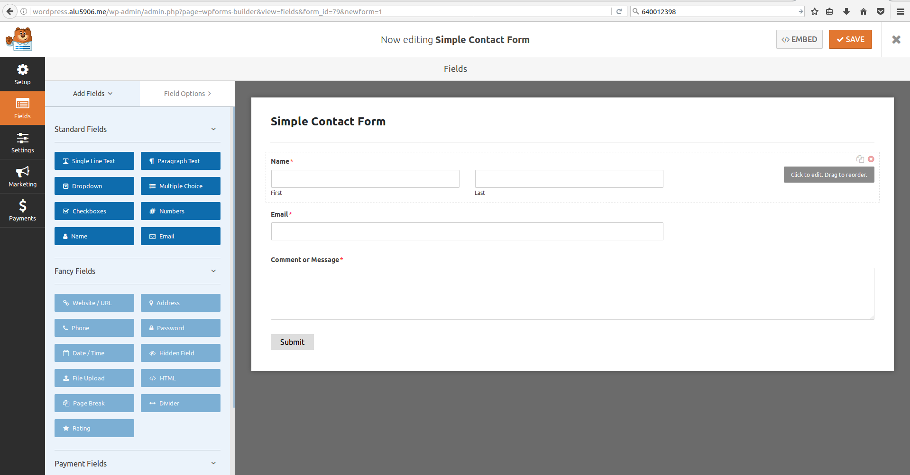

* Suggestion Form:

  Es lo mismo que el anterior lo que le añade poder añadir sugerencia y enviarlo a un departamento.

  

* Newsletter Signup Form:

  Este formulario lo utilizamos para crear nuevos ususarios, con campos como nombre , apellidos y el email.

  

> En la creacion de formulario con solo arrastrar elementos nuevos de la parte lateral izquierda al formulario, añadimos nuevos elementos a el.

* Fields

  En fields podemos editar cada uno de los Widget que tenemos en el formulario con solo pulsar en el podemos cambiar los nombres de ellos, su formato, y poner un descripción.

  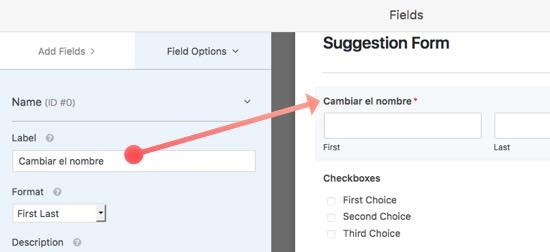

* Settings

  Una vez finalizado el formulario, podemos ir a opciones y configurar el nombre del formulario, los botones de texto que tambien lo puedes hacer antes, añadir una descripción.

  

  Tambien podemos configurar un sistema de notificación, que tiene una similitud a los tags que podemos cambiar el asuston del mail enviado.

  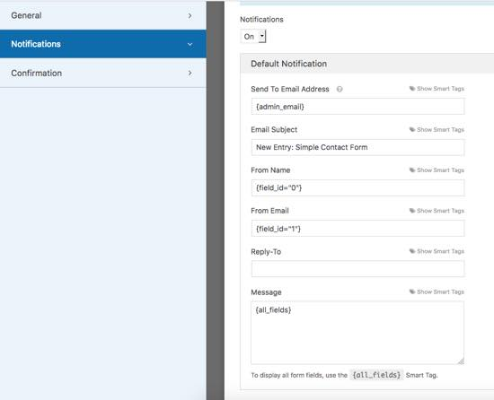

  Y por ultimo , madar un mensaje por si alguien rellena el formulario, enviar un email indicando que esta todo correcto.

  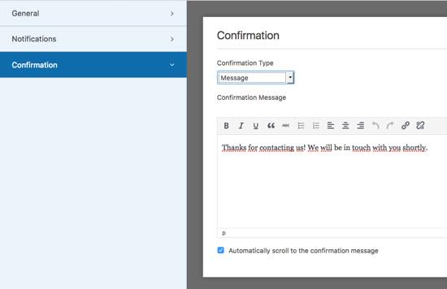

* Marketing
* Payments

> Las opciones de Marketing y Payments son de pago y no puedo mostrarlas.

### 4.Utilidad (1 a 5).

  En mi opinion personal , es una herramienta que te puede facilitar el crear formularios rapidos, funcionables y personalizables, es una herramienta muy util.

### 5.Tipo de páginas en las que sería útil.

  Hoy en dia, una pagina siempre tiene un apartado de formulario , sea para feedback, para reporte de algun bug, para ponerse en contacto con la pagina, etc, diria en casi todas.

### 6.Widgets asociados.
### 7.Requerimientos/Dependencias.

## Maintenance

  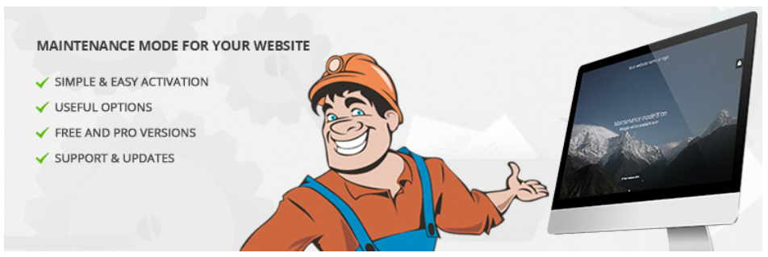

### 1.Descripción.

  El Plugin de Maintenance permite al administrador el cierre del sito web pra un mantenimiento, habilitando el servicio 503 temporalmente no disponible.

### ### 2.Facilidad de instalación/activación (1 a 5).

  Es de facil instalación es un software gratuito.

  

  Una vez activado nos aparece en el menu lateal nuestra herramienta para mantenimiento.

  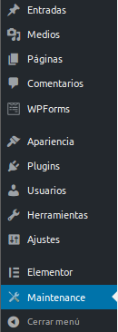

  Tambien tiene un software de pago que incluye:

  * Programar una cuenta atras.
  * Permisos de ususario.
  * Fondos de pantalla.
  * Superposicion de patrones de galeria.
  * Video de fondo
  * Video de fondo Youtube o Vimeo
  * Area adiccional de HTML
  * Perfiles sociales
  * Suscripción al boletin electronico

  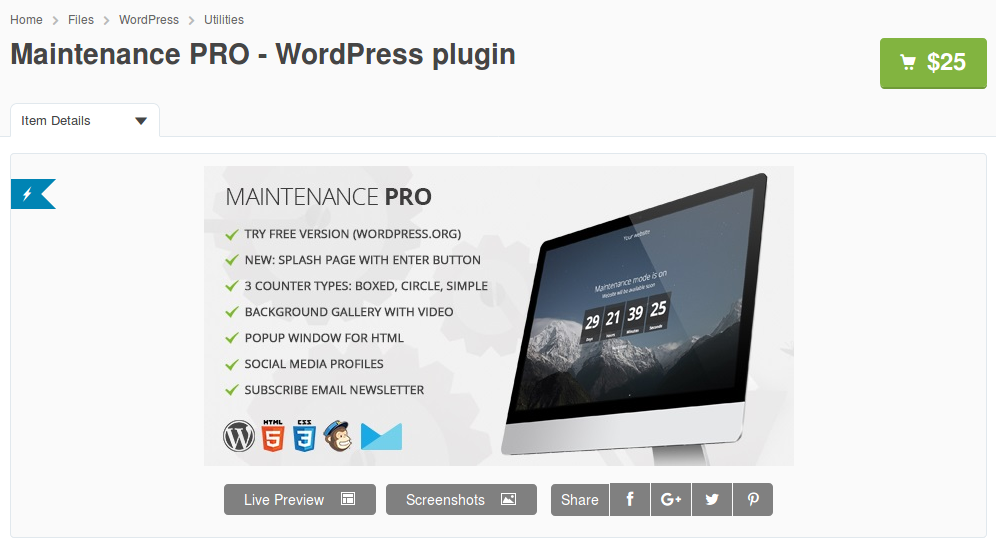

### 3.Facilidad de uso (1 a 5)

  Es sencillo de usar, en el panel de control del Plugin, configuramos la pagina que se va a visulizar habilitando el mantenimiento.

  Se puedo configurar el titulo de la pagina, cabecera, poner una descripción, texto de pie de pagina, un logo, una imagen de fondo, color de fondo, fuentes, etc.

  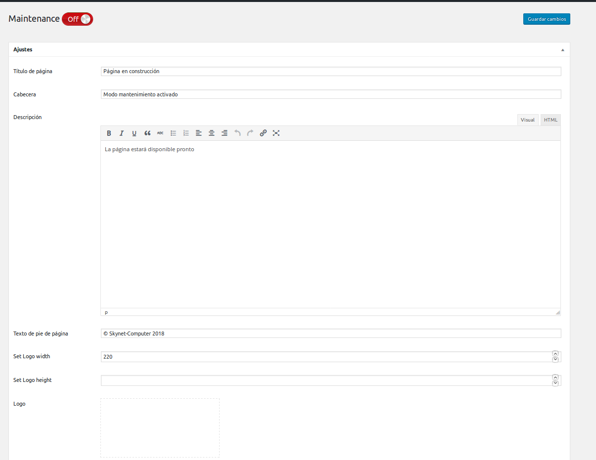
  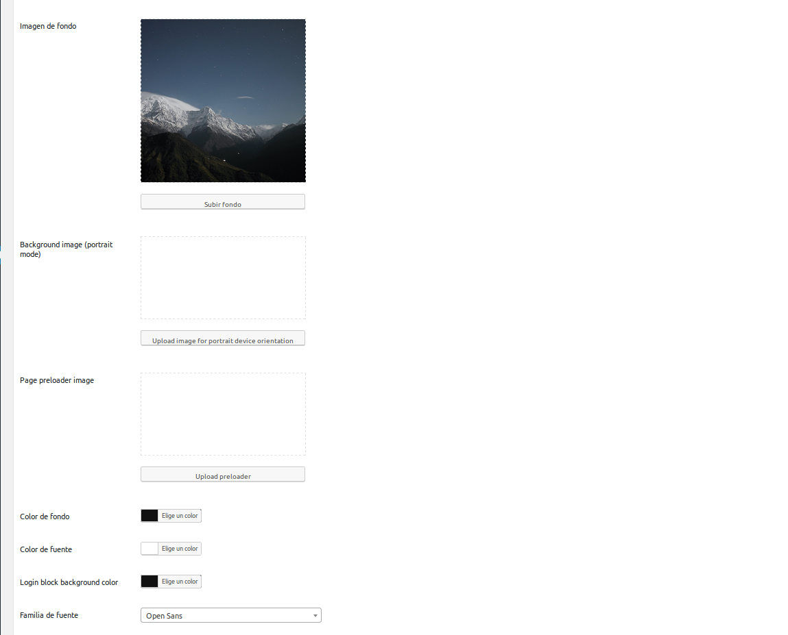

  Una vez terminado el diseño de la pagina le podemos dar al boton de mantenimiento por si necesitamos usarlo.

  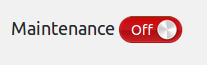

### 4.Utilidad (1 a 5).

  Es una herramienta facil y intuitiva, que podemos usar en caso de mantenimiento de nuestro sitio web.

### 5.Tipo de páginas en las que sería útil.

  En todos las paginas necesitamos hacer un mantenimiento, en una herramienta necesaria, si quieres rapidez en desplegar un mantenimiento.

### 6.Widgets asociados.

  No tiene Widgets asociados.

### 7.Requerimientos/Dependencias.

  No requiere de Dependencias.  

### Elementor Page Builder

Es un maquetador visual, que es un conjunto de herramientas que sirven para diseñar páginas web más rápido y de una forma más visual e intuitiva que como se ha hecho hasta hace poco tiempo.

Antes, si querías ser diseñador web o crear tu propia web, tenías que aprender código HTML, CSS, PHP y Javascript al menos. Eso era una barrera de entrada muy grande y definía a un profesional con un perfil más de desarrollador que de diseñador web. Así que terminabas encargando tu web a alguien que controlaba mucho de programar pero que por lo general no tenía muy buen gusto a la hora de diseñar.

Pero hoy día, cualquiera puede crear una web profesional si aprende WordPress y a manejar un maquetador visual como Elementor por ejemplo. Y además, ahora sí, con los page builders, si quieres puedes contratar a un diseñador web para crear tu página. No necesitarás un programador a no ser que quieras algo muy a medida.

Algunas de sus características son :

- Posibilidad de diseñar tocando el menor código posible.

- Facilidad de uso. Valoración (5)

- Bastante util para cualquier página o post. Valoración (5)

- Fácil instalación como podemos observar más adelante. Valoración (5)

- Diseñar una web para dispositivos móviles nunca fue tan fácil.

- Elementor Page Builder es gratis… y lo va a seguir siendo (Cuenta con una versión de pago).

- Elementor está traducido a muchos idiomas. Incluido el español.

- Es perfectamente compatible con GeneratePress.

Los pasos para su instalación son los siguientes :

Pinchamos la opción de añadir nuevo.

Vamos a la tabla periódica dada.

Y una vez seleccionado nuestro plugin le damos a descargar el archivo *.zip* .

Luego al subir plugin seleccionamos nuestro archivo zip.

Y por último marcamos la opción de instalar, en nuestro caso aparece ya activo.

Vamos a ver algunos ejemplos de cuales son sus funciones :

Primero vamos a una página creada y pinchamos en la opción de editar con Elementor.

Como podemos ver a la izquierda de la imagen, tenemos una serie de opciones que nos deja personalizar nuestra página a nuestro gusto. Y abajo a la derecha tenemos otras opciones como agregar una nueva sección, añadir una plantilla o arrastrar un widget.

Son muchas las opciones por eso vamos a ver un par de ellas como ejemplos.  

Aquí vemos la opción de insertar un video.

Vemos en esta la opción de google maps y la de iconos sociales

También podemos visualizar nuestra página en versión movil y tablet a parte de modo normal.

### Duplicate Page

Este plugin trata de duplicar publicaciones, páginas y publicaciones personalizadas fácilmente con un solo clic. Puede duplicar sus páginas, publicaciones y publicaciones personalizadas con solo un clic y se guardará como las opciones seleccionadas (borrador, privado, público, pendiente).

- Es muy sencillo de utilizar. Valoración (5)

- Es útil si quieres utilizarlo para clonar una página o un post para probar nuevas configuraciones u otras cosas en el clon y no tener que tocar el clonado. Valoración (4)

- La instalación es muy fácil de igual manera que el anterior plugin. Valoración (5)

Aquí podemos ver su función :

Vemos por ejemplo, con este post que hemos creado, que nos deja la opción de duplicarlo tan solo dando clic.

Al darle a la opción de duplicar no sale copia exacta :

